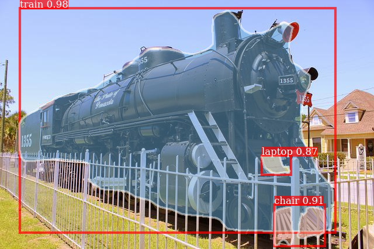

# Curated List of Faster/MaskRCNN failure cases

Two main failure cases are 
1. Missing objects when the bounding boxes are similar

**Fig:** Missing Zebras with similar bounding boxes

**Fig:** Misslocalized airplanes

More Images of this type are in artefact1/. General feature of these artefacts is that there is either bad localization(i.e, bounding box predicted) or completely missed bounding boxes.

2. Lack of global context

**Fig:** laptop, chair predicted infront of train

More Images of this type are in artefact2/. These artefacts miss global context and misclassify some of the RoIs which a human wouldn't.

Examples from MSCOCO dataset for the similar artifacts are available at https://drive.google.com/open?id=1iPQNoTNqTuDhNECCX4j7aKkDZTPDTq3T