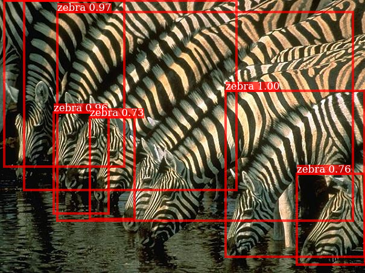
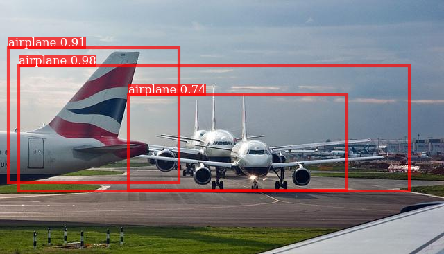
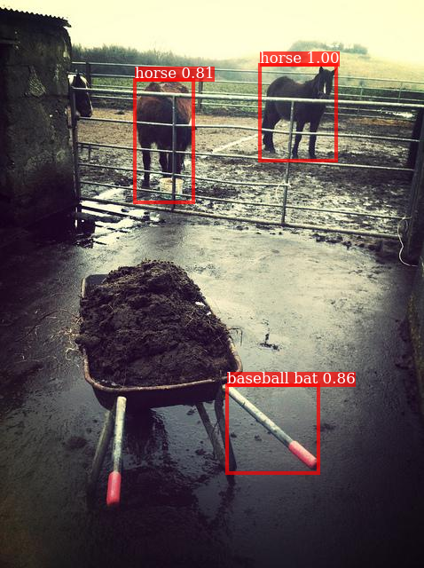

# Curated List of Resnet50-FPN-RCNN failure cases

Two main failure cases are 
1. Missing objects when the bounding boxes are similar

More Images of this type are in artefact1/. General feature of these artefacts is that there is either bad localization(i.e, bounding box predicted) or completely missed bounding boxes.

2. Lack of global context

More Images of this type are in artefact2/. These artefacts miss global context and misclassify some of the RoIs which a human wouldn't.
